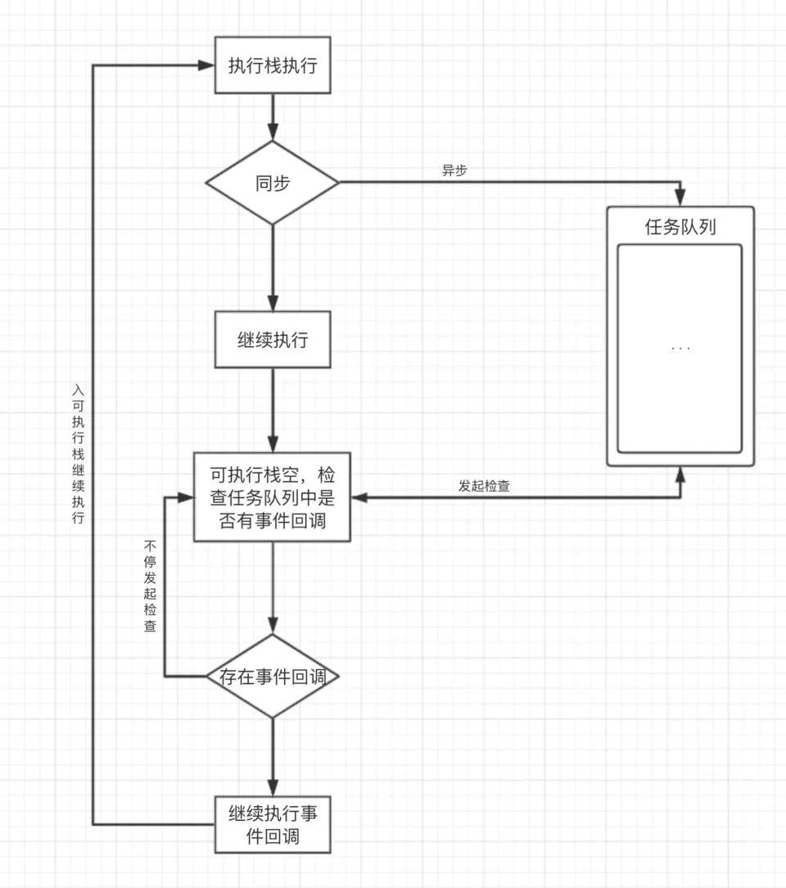
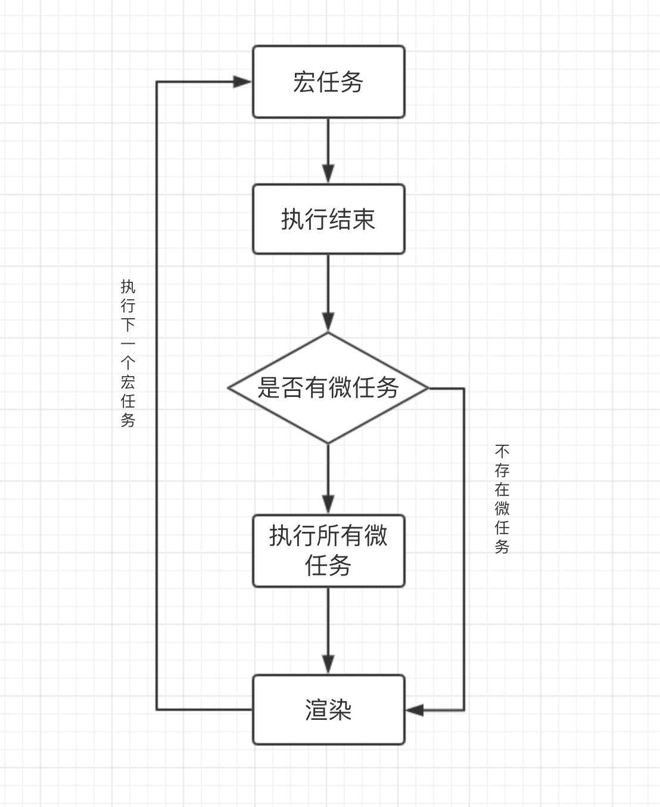
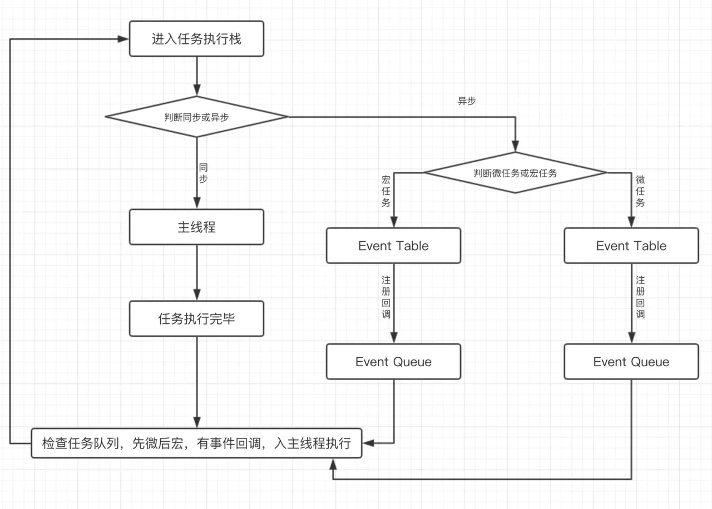

# JS 运行机制

- 本文大致分为以下这样的步骤:
  - 来帮助我们'由广入深'更加清晰的了解'JS 运行机制';

---

- 首先我们要了解:
  - '进程'的概念
  - '线程'的概念
- 其次我们要知道:
  - '浏览器'的'进程线程'常识;
- 再然后通过:
  - Event Loop
  - 宏任务(macrotask)
  - 微任务(microtask)
  - 来看浏览器的几个线程间:
    - 是怎样配合的;
- 再然后通过例子来印证我们的猜想;
- 最后提下 NodeJS 的运行机制;

## 面试必问

- JS 运行机制:
  - 在平常前端面试时不管是:
    - '笔试题'还是'面试题'命中率都极高;
- 说到 JS 运行机制，你知道多少;
- 看到这大家可能会说:
  - JS 运行机制嘛，很简单，事件循环、宏微任务那点东西;

---

- 是的，作为一名前端我们都了解;
- 但是如果这真的面试问到了这个地方;
  - 你真的可以答好吗(扪心自问);

### 场景模拟

- 不管你对 JS 了解多少，到这里大家不防先停止一下阅读;

---

- 假设你目前在面试:
  - 面试官让你阐述下'JS 运行机制';
  - 思考下你的答案，用 20 秒的时间(面试时 20s 已经很长了);
  - 然后带着答案再接着往下看:
- 引用的作者(isboyjc)名言：
  **没有思考的阅读纯粹是消磨时间罢了**

### 回过神来

- 也有很多刚开始接触 JS 的同学会被:
  - 任务队列
  - 执行栈
  - 微任务
  - 宏任务
- 这些高大上点的名次搞的很懵;

---

- 接下来，我们来细致的梳理一遍:
  - 你就可以清晰的了解它们了!(这是本文目标)

## 进程与线程

### 什么是进程

- 我们都知道:
  - CPU 是计算机的核心;
  - 承担所有的计算任务;

---

- 官网说法:
  - 进程是 CPU '资源分配'的:
    - 最小单位;
- 字面意思就是:
  - 进行中的程序,我将它理解为:
    - 一个可以独立运行:
      - 且拥有自己的资源空间的'任务程序';

---

- 进程包括:
  - 运行中的程序;
  - 程序所使用到的:
    - 内存
    - 系统资源

---

- CPU 可以有很多进程;
- 我们的电脑每打开一个软件:
  - 就会产生'一个'或'多个'进程;
- 为什么电脑运行的软件多就会卡:
  - 是因为'CPU'给每个'进程':
    - 分配资源空间;
  - 但是一个 CPU 一共就那么多资源;
    - 分出去越多，越卡;
- 每个进程之间是相互独立的;
  - CPU 在运行一个进程时:
    - 其他的进程处于'非运行'状态;

---

- CPU 使用:
  - 时间片轮转调度算法:
    - 来实现同时运行多个进程;

### 什么是线程

- 线程是 CPU'调度'的:
  - 最小单位
- 线程是建立在:
  - 进程的基础上的:
    - 一次程序运行单位;
- 通俗点解释:
  - 线程就是'程序'中的一个'执行流';
  - 一个'进程'可以有'多个线程';

---

- 一个进程中:
  - 只有一个'执行流'称作:
    - 单线程;
- 即程序执行时:
  - 所走的程序路径按照:
    - 连续顺序排下来;
      - 前面的必须处理好，后面的才会执行;

---

- 一个进程中:
  - 有'多个执行流'称作:
    - 多线程;
- 即在一个程序中:
  - 可以同时运行多个不同的线程;
    - 来执行不同的任务;
- 也就是说允许单个程序创建:
  - 多个'并行'执行的线程:
    - 来完成各自的任务;

### 进程和线程的区别

- 进程是'操作系统分配资源'的最小单位;
- 线程是'程序执行'的最小单位;

---

- 一个进程由'一个'或'多个'线程组成;
- 线程可以理解为是:
  - 一个进程中:
    - 代码的:
      - 不同执行路线;

---

- 进程之间相互独立;
- 但同一进程下的:
  - 各个线程间:
    - 共享程序的:
      - 内存空间(包括代码段、数据集、堆等);
      - 及一些'进程级'的资源(如打开文件和信号);

---

- 调度和切换:
  - 线程上下文切换:
    - 比进程上下文切换:
      - 要快得多;

### 多进程和多线程

- 多进程:
  - 多进程指的是在同一个时间里:
    - 同一个计算机系统中:
      - 允许'两个或两个以上'的'进程'处于'运行状态';

---

- 多进程带来的好处是明显的:
  - 比如大家可以在网易云听歌的同时:
    - 打开编辑器敲代码;
  - '编辑器'和'网易云'的'进程之间不会相互干扰';

---

- 多线程:
  - 多线程是指程序中:
    - 包含多个执行流;
  - 即在一个程序中,可以同时运行:
    - 多个'不同的线程'来执行'不同的任务';
  - 也就是说允许单个程序:
    - 创建多个'并行'执行的线程:
      - 来完成各自的任务;

## JS 为什么是单线程

- JS 的单线程，与它的用途有关;
- 作为浏览器脚本语言，JavaScript 的主要用途是:
  - 与用户互动;
  - 以及操作 DOM;
- 这决定了它只能是单线程;
  - 否则会带来很复杂的同步问题;
    - 比如:
      - 假定 JavaScript 同时有两个线程:
        - 一个线程在某个 DOM 节点上'添加内容';
        - 另一个线程删除了这个节点;
        - 这时浏览器应该以哪个线程为准？

---

- 还有人说 js'还有'Worker 线程;
  - 对的;
  - 为了利用多核 CPU 的计算能力;
    - HTML5 提出 Web Worker 标准:
      - 允许 JavaScript 脚本创建多个线程;
      - 但是'子线程'是完全受'主线程'控制的;
      - 而且不得操作 DOM;

<br>

- 所以，这个标准并没有改变:
  - JavaScript 是单线程的本质;

---

- 了解了'进程'和'线程'之后;
- 接下来看看浏览器解析:
  - 浏览器之间也是有些许差距的;
  - 不过大致是差不多的;
- 下文我们皆用:
  - 市场占有比例最大的 Chrome 为例;

## 浏览器

### 浏览器是多进程的

- 作为前端，免不了和浏览器打交道;
- 浏览器是多进程的;
  - 拿 Chrome 来说;
    - 我们每打开一个 Tab 页就会产生一个进程;
    - 我们使用 Chrome 打开'很多标签页不关';
      - 电脑会越来越卡;
      - 不说其他，首先就很耗 CPU(上文提到:每有一个新进程，cpu 就会分配给其独立资源);

### 浏览器包含哪些进程

- Browser 进程:
  - 浏览器的'主进程'(负责协调、主控):
    - 该进程只有一个;
  - 负责'浏览器'界面显示:
    - 与用户交互。如前进，后退等;
  - 负责各个'页面的管理':
    - 创建和销毁其他进程;
  - 将渲染(Renderer)进程得到的:
    - 内存中的 Bitmap(位图):
      - '绘制'到'用户界面'上;
  - '网络资源'的管理，下载等;

---

- 第三方插件进程:
  - 每种类型的插件对应一个进程:
    - 当使用该插件时才创建;

---

- GPU 进程:
  - 该进程也只有一个:
    - 用于 3D 绘制等等

---

- 渲染进程(重):
  - 即通常所说的'浏览器内核'(Renderer 进程，内部是多线程);
  - 每个 Tab 页面都有一个:
    - 渲染进程，互不影响;
  - 主要作用为:
    - 页面渲染
    - 脚本执行
    - 事件处理等

### 为什么浏览器要多进程

- 我们假设浏览器是单进程:
  - 那么某个 Tab 页崩溃了，就影响了整个浏览器;
  - 同理如果插件崩溃了也会影响整个浏览器;
- 当然多进程还有其它的诸多优势，不过多阐述;
- 浏览器'进程'有很多;
  - 每个'进程'又有'很多线程'，都会'占用内存';
- 这也意味着'内存等'资源消耗会很大:
  - 有点拿'空间'换'时间'的意思;
- 到此可不只是为了让我们理解为何 Chrome 运行时间长了电脑会卡;
  - 哈哈，第一个重点来了;

### 简述渲染进程 Renderer(重)

- 页面的渲染
- JS 的执行
- 事件的循环
- 都在渲染进程内执行:
  - 所以我们要重点了解渲染进程;

---

- 渲染进程是'多线程'的:
  - 我们来看'渲染进程'的一些'常用较为主要的线程';

### 渲染进程 Renderer 的主要线程

#### GUI 渲染线程

- 负责:
  - 渲染浏览器界面
  - 解析 HTML，CSS
  - 构建 DOM 树
  - RenderObject 树
  - 布局和绘制
  - 等
- 解析 html 代码(HTML 代码本质是字符串):
  - 转化为浏览器认识的节点;
  - 生成 DOM 树;
    - 也就是 DOM Tree;
- 解析 css，生成 CSSOM(CSS 规则树);
- 把 DOM Tree 和 CSSOM 结合;
  - 生成 Rendering Tree(渲染树);

---

- 当我们修改了一些元素的'颜色'或者'背景色':
  - 页面就会重绘(Repaint);

---

- 当我们修改元素的尺寸:
  - 页面就会回流(Reflow);

---

- 当页面需要 Repaing 和 Reflow 时:
  - GUI 线程执行，绘制页面;

---

- '回流(Reflow)'比'重绘(Repaint)'的'成本要高';
  - 我们要尽量避免 Reflow 和 Repaint;

---

- 'GUI 渲染线程'与'JS 引擎线程'是互斥的:
  - 当 JS 引擎执行时:
    - GUI 线程会被挂起(相当于被冻结了);
  - GUI 更新会被保存在一个队列中:
    - 等到 JS 引擎空闲时立即被执行;

#### JS 引擎线程

- JS 引擎'线程':
  - 就是 JS 内核:
    - 负责处理 Javascript 脚本程序(例如 V8 引擎);
- JS 引擎'线程':
  - 负责解析 Javascript 脚本，运行代码;
- JS 引擎一直等待着:
  - 任务队列中任务的到来;
    - 然后加以处理:
      - 浏览器同时只能有一个:
        - JS 引擎线程在运行 JS 程序;
        - 所以 js 是单线程运行的;
      - 一个 Tab 页(renderer 进程)中:
        - 无论什么时候都:
          - 只有一个 JS 线程在运行 JS 程序;
- 'GUI 渲染线程'与'JS 引擎线程'是'互斥'的:
  - js 引擎线程会'阻塞'GUI 渲染线程;
    - 就是我们常遇到的 JS 执行时间过长:
      - 造成页面的渲染不连贯;
      - 导致页面渲染加载阻塞(就是加载慢);
    - 例如浏览器渲染的时候遇到`<script>`标签:
      - 就会停止 GUI 的渲染;
      - 然后 js 引擎线程开始工作;
        - 执行里面的 js 代码;
        - 等 js 执行完毕;
        - js 引擎线程停止工作;
      - GUI 继续渲染下面的内容;
      - 所以如果'js 执行时间太长'就会造成'页面卡顿'的情况;

#### 事件触发线程

- 事件触发线程:
  - 属于'浏览器'而不是'JS 引擎';
  - 用来控制事件循环;
  - 并且管理着一个事件队列(task queue);
- 当 js 执行碰到:
  - 事件绑定;
  - 一些异步操作:
    - 如 setTimeOut;
    - 也可来自浏览器内核的其他线程;
    - 如鼠标点击、AJAX 异步请求等;
  - 会走事件触发线程:
    - 将对应的事件添加到对应的线程中:
      - 比如定时器操作:
        - 便把'定时器事件'添加到'定时器线程';
    - 等异步事件有了结果:
      - 把他们的回调操作添加到事件队列;
      - 等待 js 引擎线程空闲时来处理;
- 当对应的事件符合触发条件被触发时:
  - 该线程会把事件添加到:
    - 待处理队列的队尾;
    - 等待 JS 引擎的处理;
- 因为 JS 是单线程;
  - 所以这些待处理队列中的:
    - 事件都得排队等待 JS 引擎处理;

#### 定时触发器线程

- setInterval 与 setTimeout 所在线程;
- 浏览器'定时计数器'并不是由'JavaScript 引擎'计数的;
  - 因为 JavaScript 引擎是'单线程'的:
    - 如果处于'阻塞线程状态'就会'影响记计时的准确';
- 通过'单独线程'来计时并'触发'定时;
  - 计时完毕后:
    - 添加到'事件触发线程'的'事件队列中';
    - 等待 JS 引擎空闲后执行;
  - 这个线程就是'定时触发器线程'，也叫'定时器线程';
- W3C 在 HTML 标准中规定:
  - 规定要求 setTimeout 中低于 4ms 的时间间隔算为 4ms;

#### 异步 http 请求线程

- 在 XMLHttpRequest 连接后:
  - 是通过'浏览器'新开一个'线程请求';
- 将检测到状态变更时:
  - 如果设置有回调函数;
    - '异步线程'就'产生状态变更事件';
      - 将这个'回调'再放入'事件队列'中再由'JavaScript 引擎'执行;
- 简单说就是:
  - 当执行到一个 http 异步请求时:
    - 就把'异步请求事件'添加到'异步请求线程';
      - 等收到响应(准确来说应该是 http 状态变化);
      - 再把'回调函数'添加到'事件队列';
      - 等待 js 引擎线程来执行;

---

- 了解了上面这些基础后:
  - 接下来我们开始进入今天的正题;

## 事件循环(Event Loop)初探

- 首先要知道，JS 分为:
  - 同步任务
  - 异步任务

---

- '同步任务'都在'主线程'上执行 ———— (这里的'主线程'就是'JS 引擎线程');
  - 会形成一个执行栈;

---

- 主线程之外:
  - '事件触发线程'管理着一个'任务队列';
  - 只要'异步任务'有了运行结果;
    - 就在任务队列之中放一个事件回调;(定时器执行完毕，就将其放到任务队列的末尾，等待主线程执行);

---

- 一旦执行栈中:
  - 所有同步任务执行完毕(也就是 JS 引擎线程空闲了);
  - 系统就会读取'任务队列':
    - 将'可运行的'异步任务: ———— (啥叫可运行？指的就是已经有了回调的异步任务，比如已经完成计数的定时器);
      - 添加到执行栈中，开始执行;
  - 任务队列中的事件回调;
    - 只要任务队列中有事件回调;
    - 就说明可以执行;

---

- 我们来看一段简单的代码:

```js
let setTimeoutCallBack = function () {
  console.log("我是定时器回调");
};
let httpCallback = function () {
  console.log("我是http请求回调");
};

// 同步任务
console.log("我是同步任务1");

// 异步定时任务
setTimeout(setTimeoutCallBack, 1000);

// 异步http请求任务
ajax.get("/info", httpCallback);

// 同步任务
console.log("我是同步任务2");
```

- 上述代码执行过程:
  - JS 是按照顺序'从上往下'依次执行的;
  - 可以先理解为这段代码的:
    - 执行环境就是:
      - 主线程
  - 也就是也就是当前执行栈;

---

- 首先，执行 console.log('我是同步任务 1');

---

- 接着，执行到 setTimeout 时:
  - 会移交给'定时器线程'，通知'定时器线程':
    - 1s 后将 setTimeoutCallBack 这个'回调'交给'事件触发线程'处理;
      - 在 1s 后事件触发线程会收到 setTimeoutCallBack 这个回调:
        - 把它加入到:
          - 事件触发线程所管理的'事件队列'中'等待执行';

---

- 接着，执行 http 请求:
  - 会移交给异步 http 请求线程:
    - 发送网络请求;
    - 请求成功后:
      - 将 httpCallback 这个'回调'交由'事件触发线程'处理;(与上面定时器任务同理)
        - '事件触发线程'收到 httpCallback 这个'回调'后:
          - 把它加入到'事件触发线程'所管理的'事件队列'中'等待执行';

---

- 再接着执行 console.log('我是同步任务 2');

---

- 至此'主线程执行栈'中执行完毕;
- JS 引擎线程已经空闲;
  - 开始向'事件触发线程'发起询问:
    - 询问'事件触发线程'的'事件队列'中是否有'需要执行的回调函数';
    - 如果有将'事件队列'中的'回调事件'加入'执行栈'中;
      - 开始执行回调;
      - 如果事件队列中没有回调;
        - 'JS 引擎线程'会一直发起询问，直到有为止;

---

- 到了这里我们发现:
  - 浏览器上的所有'线程'的工作都很'单一'且'独立';
  - 非常符合单一原则;

---

- '定时触发线程'只管理:
  - '定时器'且只关注'定时'不关心'结果';
- 定时结束就把'回调'扔给'事件触发线程';

---

- '异步 http 请求线程'只管理'http'请求同样'不关心结果';
  - 请求结束把回调扔给事件触发线程;

---

- '事件触发线程'只关心'异步回调'入'事件队列';

---

- 而我们'JS 引擎线程'只会执行'执行栈'中的'事件';
  - '执行栈'中的'代码'执行完毕;
  - 就会读取'事件队列'中的'事件'并添加到'执行栈'中'继续执行';
  - 这样反反复复就是我们所谓的'事件循环(Event Loop)';
- 图解
  
- 首先，执行栈开始顺序执行:
  - 判断是否为同步;
  - 异步则进入异步线程;
    - 最终'事件回调'给'事件触发线程'的'任务队列'等待执行;
- 执行栈空，询问'任务队列'中是否有'事件回调';
- '任务队列'中有'事件回调':
  - 则把'回调'加入'执行栈末尾'继续从'第一步开始'执行;
- 任务队列中没有'事件回调'则'不停发起询问';

## 宏任务(macrotask) & 微任务(microtask)

### 宏任务(macrotask)

- 在 ECMAScript 中，macrotask 也被称为 task;

---

- 我们可以将每次'执行栈'执行的代码当做是一个宏任务;
  - 包括每次从'事件队列'中获取一个事件回调:
    - 并放到'执行栈'中执行;
- 每一个宏任务会'从头到尾'执行完毕，'不会执行其他';

---

- 由于:
  - JS 引擎线程
  - GUI 渲染线程
- 是互斥的关系;
- 故浏览器为了能够使:
  - 宏任务
  - DOM 任务
- 有序的进行:
  - 会在一个'宏任务'执行结果'后':
    - 在下一个'宏任务'执行'前':
      - GUI 渲染线程开始工作;
        - 对页面进行渲染;

```
宏任务 -> GUI渲染 -> 宏任务 -> GUI渲染 -> 宏任务 -> GUI渲染 -> 宏任务 ->...
```

- 常见的宏任务:
  - 主代码块
  - setTimeout
  - setInterval
  - setImmediate ()-Node
  - requestAnimationFrame ()-浏览器

### 微任务(microtask)

- ES6 新引入了 Promise 标准;
- 同时浏览器实现上多了一个 microtask 微任务概念;
- 在 ECMAScript 中，microtask 也被称为 jobs;

---

- 我们已经知道'宏任务'结束后;
  - 会执行渲染;
    - 然后执行下一个'宏任务';
- 而微任务可以理解成:
  - 在当前'宏任务'执行后'立即执行'的任务;

---

- 当一个'宏任务'执行完:
  - 会在渲染前:
    - 将'执行期间'所产生的'所有微任务'都执行完;

```
宏任务 -> 微任务 -> GUI渲染 -> 宏任务 -> 微任务 -> GUI渲染 -> 宏任务 -> ...
```

- 常见微任务:
  - process.nextTick ()-Node
  - Promise.then()
  - catch
  - finally
  - Object.observe
  - MutationObserver(手写 Promise，可以用到)

### 简单区分宏任务与微任务

- 看了上述宏任务微任务的解释你可能还不太清楚;
  - 没关系，往下看;
  - 先记住那些常见的'宏微任务'即可;

---

- 找一个空白的页面，在 console 中输入以下代码:

```js
document.body.style = "background:black";
document.body.style = "background:red";
document.body.style = "background:blue";
document.body.style = "background:pink";
```

- 上面动图背景直接渲染了粉红色:
  - 根据上文里讲浏览器会先执行完一个宏任务;
  - 再执行当前执行栈的所有微任务;
  - 然后移交 GUI 渲染;
- 然而上面四行代码均属于同一次宏任务:
  - 全部执行完才会执行渲染;
  - 渲染时:
    - GUI 线程
      - 会将所有 UI 改动优化合并;
- 所以视觉上，只会看到页面变成粉红色;

---

- 再接着看:

```js
document.body.style = "background:blue";
setTimeout(() => {
  document.body.style = "background:black";
}, 200);
```

- 上述代码中，页面会先卡一下蓝色，再变成黑色背景;
  - 之所以会卡一下蓝色，是因为以上代码属于两次'宏任务';
    - 第一次'宏任务'执行的代码是:
      - 将背景变成蓝色;
      - 然后触发渲染:
        - 将页面变成蓝色;
    - 再触发第二次宏任务将背景变成黑色;
- 页面上写的是 200 毫秒，大家可以把它当成 0 毫秒，因为 0 毫秒的话由于浏览器渲染太快，不好捕捉;

---

- 再来看:

```js
document.body.style = "background:blue";
console.log(1);
Promise.resolve().then(() => {
  console.log(2);
  document.body.style = "background:pink";
});
console.log(3);
```

- 控制台输出 1 3 2:
  - 是因为 promise 对象的 then 方法的回调函数是'异步执行';
  - 所以 2 最后输出;
- 页面的背景色直接变成粉色;
- 没有经过蓝色的阶段,是因为:
  - 我们在'宏任务'中将背景设置为蓝色;
    - 但在'进行渲染前'执行了'微任务':
      - 在'微任务'中将背景变成了粉色;
      - '然后才执行的渲染';

### 微任务宏任务注意点

- 浏览器会先执行一个宏任务；
  - 紧接着执行当前'执行栈'产生的'微任务';
    - 再进行渲染;
      - 然后再'执行'下一个'宏任务';
- '微任务'和'宏任务'不在一个任务队列:
  - 例如:
    - setTimeout 是一个'宏任务':
      - 它的事件回调在'宏任务队列';
    - Promise.then()是一个'微任务';
      - 它的事件回调在'微任务队列';
    - 二者并不是一个任务队列;
  - 以 Chrome 为例:
    - 有关'渲染'的都是在'渲染进程'中'执行';
    - 渲染进程中的任务:
      - DOM 树构建，js 解析…等等
    - 需要'主线程执行的任务'都会在'主线程'中'执行';
    - 而'浏览器'维护了一套'事件循环机制':
      - '主线程'上的'任务'都会放到'消息队列'中'执行';
      - 主线程会'循环'消息队列:
        - 并从'头部'取出'任务'进行执行;
        - 如果执行过程中:
          - 产生其他任务:
            - 需要主线程执行的;
        - 渲染进程中的其他线程会把该任务:
          - 塞入到消息队列的尾部;
    - 消息队列中的任务都是宏任务;
  - 微任务是如何产生的呢？
    - 当执行到script脚本的时候:
      - js引擎会为全局创建一个'执行上下文':
        - 在该'执行上下文中'维护了一个'微任务队列';
        - 当遇到微任务:
          - 就会把'微任务回调'放在'微队列'中;
          - 当所有的js代码执行完毕:
            - 在'退出全局上下文之前'引擎会去'检查该队列';
              - 有回调就执行，没有就退出执行上下文;
                - 这也就是为什么'微任务'要'早于宏任务'(因为本质上来说，code外面包裹着一个最大的宏任务);
                - 也是大家常说的:
                  - 每个宏任务都有一个微任务队列;
                    - 由于定时器是浏览器的API:
                      - 所以定时器是宏任务;
                      - 在js中遇到定时器会也是放入到浏览器的队列中;

---

- 此时，你可能还很迷惑，没关系，请接着往下看

### 图解宏任务和微任务

- 图解
  
- 首先执行一个宏任务:
  - 执行结束后判断:
    - 是否存在微任务;
- 有'微任务'先执行'所有的微任务';
  - 再渲染，没有'微任务'则直接渲染;
- 然后再接着执行下一个宏任务;

## 图解完整的Event Loop

- 图解
  
