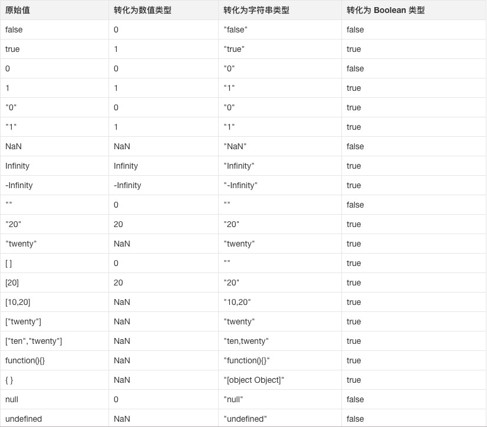

# Javascript 面试题

## 解释下变量提升?

- JavaScript 引擎的工作方式是:
  - 先解析代码:
    - '获取' 所有 '被声明的变量';
  - 然后再一行一行地运行;
- 这造成的结果:
  - 就是 '所有的变量' 的 '声明语句';
    - 都会被提升到代码的头部;
      - 这就叫做变量提升(hoisting);

---

```js
console.log(a); // undefined
var a = 1;
function b() {
  console.log(a);
}
b(); // 1
```

- 上面的代码 '实际执行顺序' 是这样的:
- 第一步:
  - 引擎将 var a = 1 拆解为 var a = undefined 和 a = 1 ;
    - 然后将 var a = undefined 放到最顶端;
      - a = 1 还在原来的位置;
- 这样一来代码就是这样:

```js
var a = undefined;
console.log(a); // undefined

a = 1;

function b() {
  console.log(a);
}
b(); // 1
```

- 第二步:
  - 就是执行;
    - js 引擎一行一行从上往下执行:
      - 就造成了当前的结果，这就叫变量提升;

## 一段 JavaScript 代码是如何执行的?

- 请移步至同目录下的 "Work.md"进行查阅;

## 理解闭包吗?

- 这个问题其实在问:
  - 闭包是什么?
  - 闭包有什么作用?

### 闭包是什么?

- MDN 的解释:
  - 闭包是:
    - '函数' 和 '声明该函数' 的:
      - '词法环境' 的 '组合';
- 按照作者的理解就是:
  - **'闭包 = '函数'' 和 '函数体内可访问的变量总和'**';
    - 举个简单的例子:

```js
(function () {
  var a = 1;
  function add() {
    var b = 2;
    var sum = b + a;
    console.log(sum); // 3
  }
})();
```

- **add 函数本身**:
  - 以及其内部可访问的变量:
    - 即 **a = 1** ;
      - 这 '两个组合' 在一起:
        - 就被称为闭包，仅此而已;

### 闭包的作用

- 闭包最大的作用就是:
  - **隐藏变量**;
- 闭包的一大特性就是:
  - '内部函数' 总是可以访问:
    - **其所在的外部函数中**
      - 声明的 '参数' 和 '变量';
        - 即使在其外部函数被返回(寿命终结)了之后;

> 基于此特性，JavaScript 可以实现私有变量、特权变量、储存变量等;

---

- 我们就以私有变量举例;
  - 私有变量的实现方法很多:
    - 有靠约定的(变量名前加`_`);
    - 有靠 Proxy 代理的;
    - 也有靠 Symbol 这种新数据类型的;

> 但是真正广泛流行的其实是使用闭包;

```js
function Person() {
  var name = "cxk";
  this.getName = function () {
    return name;
  };
  this.setName = function (value) {
    name = value;
  };
}

const cxk = new Person();

console.log(cxk.getName()); // cxk
cxk.setName("jntm");
console.log(cxk.getName()); // jntm
console.log(name); // name is not defined
```

- 函数体内的:

```js
var name = "cxk";
```

- 只有:
  - getName 和 setName;
    - 两个函数可以访问;
- 外部无法访问:
  - 相当于将 '变量私有化';

## JavaScript 的作用域链理解吗?

- JavaScript 属于 '静态作用域';
  - 即 '声明的作用域' 是根据:
    - 程序正文在 '编译时' 就 '确定的':
      - 有时也称为词法作用域;
- 其本质是:
  - JavaScript 在执行过程中:
    - 会创造 '可执行上下文';
      - 可执行上下文中的 '词法环境' 中:
        - 含有 '外部词法环境' 的 '引用';
          - 我们可以通过这个引用:
            - 获取外部词法环境的变量、声明等;

> 这些 '引用'串联起来 '一起指向全局的词法环境'，因此形成了 '作用域链';

## ES6 模块与 CommonJS 模块有什么区别?

- ES6 Module 和 CommonJS 模块的区别:
  - 两者:
    - CommonJS 是:
      - 对模块的 '浅拷⻉';
    - ES6 Module 是:
      - 对模块的 '引用';
        - 即 ES6 Module 只存只读，不能改变其值;
          - 具体点就 是指针指向不能变，类似 const;
  - import 的接口是 read-only(只读状态);
    - 不能修改其变量值;
      - 即不能修改其变量的指针指向，但可以改变变量内部指针指向;
        - 可以对 commonJS 对重新赋值(改变指针指向);
        - 但是对 ES6 Module 赋值会编译报错;

---

- ES6 Module 和 CommonJS 模块的共同点:
  - CommonJS 和 ES6 Module 都可以:
    - 对 '引入的对象' 进行赋值;
      - 即对 '对象内部属性' 的值进行改变;

## js 有哪些类型?

- JavaScript 的类型分为两大类，一类是原始类型，一类是复杂(引用)类型;
  - 原始类型:
    - boolean
    - null
    - undefined
    - number
    - string
    - symbol
  - 复杂类型:
    - Object;

> 还有一个没有正式发布但即将被加入标准的原始类型 BigInt;

## 为什么会有 BigInt 的提案?

- JavaScript 中:
  - Number.MAX_SAFE_INTEGER 表示最大安全数字;
    - 计算结果是 9007199254740991;
      - 即在这个数 '范围内' 不会出现 '精度丢失' (小数除外);
  - 但是一旦超过这个范围:
    - js 就会出现计算不准确的情况;
      - 这在 '大数计算' 的时候:
        - 不得不依靠一些 '第三方库' 进行解决;

> 因此官方提出了 BigInt 来解决此问题;

## null 与 undefined 的区别是什么?

- null 表示为空:
  - 代表此处 '不应该有值' 的存在;
- 一个 '对象' 可以是 null;
  - 代表是个 '空对象', **而 null 本身也是对象**;

---

- undefined 表示 '不存在';
  - JavaScript 是一⻔ '动态类型语言';
    - 成员除了表示 '存在的空值' 外;
      - 还有可能 '根本就不存在'; (因为存不存在只在运行期才知道)
        - 这就是 undefined 的意义所在;

## 0.1+0.2 为什么不等于 0.3?

- JS 的 Number 类型遵循的是 IEEE 754 标准;
  - 使用的是 64 位固定⻓度来表示;
- IEEE 754 浮点数由 '三个域' 组成:
  - 分别为:
    - sign bit (符号位)
    - exponent bias (指数偏移值)
    - fraction (分数值)
- 64 位中:
  - sign bit 占 1 位;
  - exponent bias 占 11 位;
  - fraction 占 52 位;

> 通过公式表示浮点数的值 value = sign x exponent x fraction

- 当一个数为 '正数':
  - sign bit 为 0;
- 当为 '负数' 时:
  - sign bit 为 1;

---

- 以 0.1 转换为 IEEE 754 标准 '表示为例':
  - 解释一下如何求 exponent bias 和 fraction;
- 转换过程主要经历 3 个过程:
  - 将 0.1 转换为 '二进制' 表示;
  - 将转换后的 '二进制':
    - 通过 '科学计数法' 表示;
  - 将通过 '科学计数法' 表示的 '二进制':
    - 转换为 IEEE 754 标准表示;

### 将 0.1 转换为二进制表示

- 回顾一下:
  - 一个数的小数部分:
    - 如何转换为二进制;
- 一个数的小数部分:
  - 乘以 2;
    - 然后取 '整数部分' 的 '结果';
      - 再用 '计算后的小数部分' **重复计算**;
        - **直到小数部分为 0**;
- 因此 0.1 转换为二进制表示的过程如下:

```
0.1     0.2     0
0.2     0.4     0
0.4     0.8     0
0.8     1.6     1
0.6     1.2     1
0.2     0.4     0
0.4     0.8     0
0.8     1.6     1
0.6     1.2     1
...     ...     ...
```

> 得到 0.1 的二进制表示为 0.00011...(无限重复 0011);

### 通过科学计数法表示

- 0.00011...(无限重复 0011) 通过 '科学计数法' 表示则是:
  - **1.10011001...(无线重复 1001)\*10^-4**;

### 转换为 IEEE 754 标准表示

- 当经过科学计数法表示之后;
  - 就可以求得 exponent bias 和 fraction 了;

---

- exponent bias (指数偏移值) 等于:
  - 双精度浮点数固定偏移值 (2^10-1)
    - 加上指数实际值(即 10^-4 中的 -4) 的 11 位二进制表示;
      - 为什么是 11 位?
        - 因为 exponent bias 在 64 位中占 11 位;
- 因此 0.1 的 exponent bias 等于:
  - 1023 + (-4) = 1019 的 11 位二进制表示:
    - 即 011 1111 1011;

---

- 再来获取 0.1 的 fraction:
  - fraction 就是 1.10011001...(无线重复 1001) 中的小数位;
    - 由于 fraction 占 52 位所以抽取 52 位小数:
      - 1001...(中间有 11 个 1001)...1010;

> 请注意最后四位:
>
> > **是 1010 而不是 1001**:
> >
> > > 因为四舍五入有进位;
> > > 这个 '进位' 就是造成 0.1 + 0.2 不等于 0.3 的原因;

- sign bit: 0;
- exponent bias: 011 1111 1011;
- fraction: 1001...( 11x 1011 ) ... 1010

---

- 此时如果将这个数转换为 '十进制':
  - 可以发现值已经变为:
    - 0.100000000000000005551115123126 而不是 0.1 了;
      - 因此这 个计算精度就出现了问题;

## 类型转换的规则有哪些?

- 在:
  - if语句
  - 逻辑语句
  - 数学运算逻辑
  - ==
  - ......
- 都可能出现 '隐式类型转换';
  - 坑一: '字符串连接符' 与 '算术运算符' 隐式转换规则混淆;
  - 坑二: '关系运算符' :
    - 会把 '其他数据类型' 转换成 'number' 之后再比较关系;
  - 坑三: '复杂数据类型' 在隐式转换时会 '先转成String',然后 '再转成Number'运算;
  - 坑四: '逻辑非隐式转换' 与 '关系运算符隐式转换' 搞混淆;
- 